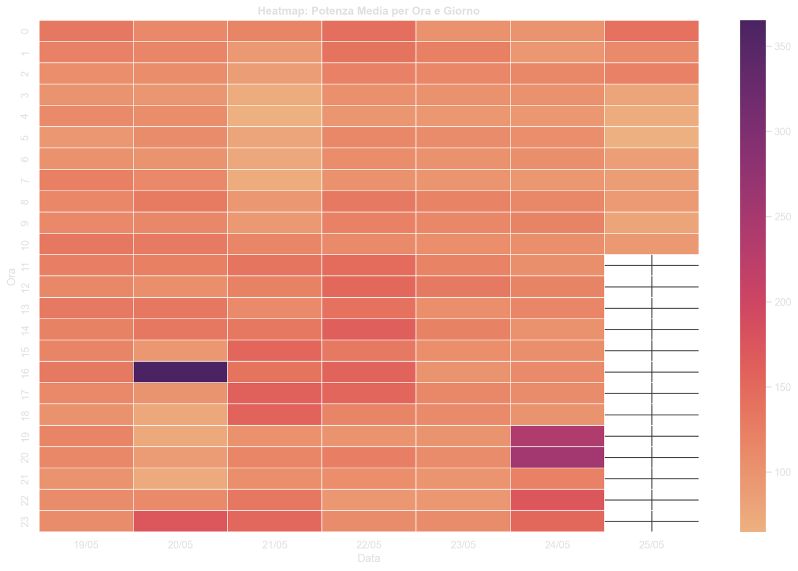
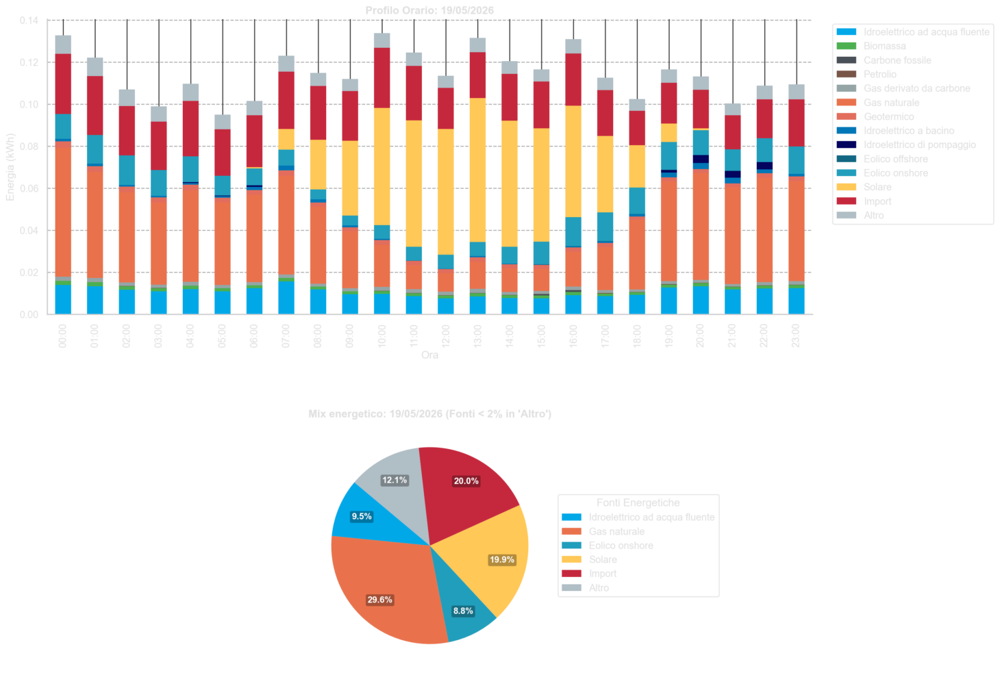
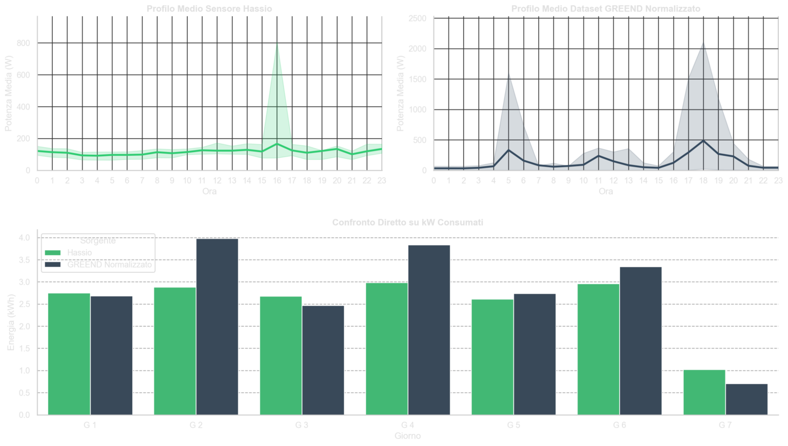

# Analisi Consumi Energetici

Dashboard interattiva per l'analisi e la visualizzazione dei consumi energetici domestici, costruita con **Python** e **Streamlit**. Il progetto integra dati rilevati tramite Home Assistant (Hassio), il mix energetico nazionale italiano e il dataset di ricerca **GREEND** per offrire un quadro completo e contestualizzato dei propri consumi.

---

## Progetto Correlato
Questo repository rappresenta l'evoluzione software e l'analisi dati del progetto **[pinza-amperometrica](https://github.com/ilbruzzz/pinza-amperometrica)**, che si occupa della parte hardware e della raccolta dati tramite sensore fisico.

---

## Screenshot


*Heatmap della potenza media assorbita: permette di individuare a colpo d'occhio i pattern di consumo per ora e giorno.*


*Profilo orario di un singolo giorno con breakdown del mix energetico per fonte.*


*Confronto tra i dati del sensore reale e il dataset GREEND normalizzato sui consumi medi italiani.*

---

## Struttura del Progetto

```
analisi_consumi_energetici/
├── main.py                          # Entry point: esegue la pipeline di elaborazione dati
├── grafici_streamlit.py             # App Streamlit con tutte le viste grafiche
├── connect.py                       # Connessione e autenticazione con Home Assistant
├── requirements.txt                 # Dipendenze Python
├── .env                             # Variabili d'ambiente (non incluso nel repo)
├── .gitignore
│
├── export/
│   ├── export.py                    # Estrazione e salvataggio dati da Hassio
│   └── export_consumi_nazionali.py  # Scarica il mix energetico nazionale
│
└── manipolazione_dati/
    ├── pulizia_csv.py               # Pulizia e aggregazione dei CSV grezzi
    ├── maipola_df_GREEND.py         # Generazione della baseline GREEND
    ├── normalizza_GREEND.py         # Normalizzazione GREEND con il Portale dei Consumi
    └── data/                        # Cartella dei CSV elaborati (generata a runtime)
```

---

## Pipeline di Elaborazione

Il file `main.py` esegue in sequenza i seguenti passaggi:

1. **Estrazione dati Hassio** — scarica i consumi rilevati dal sensore di casa tramite `connect.py`
2. **Pulizia e aggregazione CSV** — normalizza e aggrega i dati grezzi in `manipolazione_dati/data/`
3. **Download mix energetico** — incrocia le date del file pulito con il mix energetico nazionale (fonte: ENTSO-E / Terna)
4. **Generazione baseline GREEND** — pulisce il dataset GREEND per usarlo come riferimento
5. **Normalizzazione GREEND** — scala il profilo GREEND sui valori reali del Portale dei Consumi italiano

---

## Viste Disponibili nella Dashboard

La dashboard Streamlit (`grafici_streamlit.py`) offre 14 viste selezionabili dalla sidebar:

| Vista | Descrizione |
|---|---|
| Spesa per Fasce Orarie (F1/F2/F3) | Costo totale suddiviso per fascia ARERA |
| Spesa Energetica Giornaliera | Costo giorno per giorno con media |
| Confronto Hassio vs GREEND | Profilo medio sensore vs dataset di ricerca normalizzato |
| Correlazione tra Fonti | Heatmap di correlazione tra le sorgenti del mix energetico |
| Volatilità Consumi | Deviazione standard oraria dei consumi |
| Distribuzione Frequenze | Istogramma dei wattaggi rilevati (scala logaritmica) |
| Confronto Fasce Orarie (Boxplot) | Boxplot affiancati per F1, F2, F3 e "Tutte le fasce" |
| Heatmap Potenza Media | Mappa ora × giorno della potenza media assorbita |
| Analisi Statistica Giornaliera | Barre affiancate di media, mediana e deviazione standard |
| Box-Plot Distribuzione Giornaliera | Distribuzione dei consumi giorno per giorno |
| Trend Utilizzo Fonti | Andamento storico del mix di fonti per giorno |
| Energia Totale per Giorno | Barre impilate (kWh) con breakdown per fonte |
| Profilo Giornaliero | Dettaglio orario + torta del mix per un singolo giorno |
| Dettaglio Normalizzazione GREEND | Confronto Raw / Clipped / Target Portale / Normalizzato |

---

## Configurazione

Il progetto si configura tramite un file `.env` nella root del repository. Il file non è incluso nel repo e va creato manualmente. Di seguito tutte le variabili richieste con la relativa spiegazione:

```dotenv
# Token di accesso Long-Lived di Home Assistant.
# Generabile da: Profilo utente > Token di accesso a lunga durata.
TOKEN = eyJhbGciOiJIUzI1NiIsInR5cCI6IkpXVCJ9...

# URL base dell'istanza Home Assistant (senza slash finale).
URL_HASSIO = https://tuodominio.duckdns.org

# Entity ID del sensore di consumo istantaneo configurato in Hassio.
ENTITY_ID = sensor.pinza_amperometrica_consumo_istantaneo

# Numero di giorni storici da scaricare da Hassio (usato in modalità online).
GIORNI = 7

# Nomi dei file CSV usati e generati dalla pipeline (relativi a manipolazione_dati/data/).
FILE = storico_sensore.csv
FILE_PULITO = storico_sensore_pulito.csv
EXPORT_MIX_ENERGETICO_NAZIONALE = mix_energetico_nazionale.csv
FILE_GREEND = dataset_GREEND.csv
FILE_GREEND_NORMALIZZATO = dataset_GREEND_normalizzato.csv
FILE_PORTALE = portale_dei_consumi_media_italia_3kW.csv

# Potenza massima del contatore in Watt (tipicamente 3300 W per contratti da 3 kW).
CONTRATTO = 3300

# Consumo stimato in standby dell'abitazione in Watt.
# Usato come soglia minima nella normalizzazione GREEND.
W_STANDBY = 80

# Costo dell'energia in €/kWh (valore base da bolletta).
COSTO = 0.204730

# Modalità offline: se true, non si connette a Hassio e usa i file CSV già presenti.
# Utile per lavorare sui dati senza connessione all'istanza.
IS_OFFLINE = false

# Intervallo temporale da analizzare in modalità offline (formato ISO 8601).
DATA_INIZIO = 2026-02-16T00:00:00+01:00
DATA_FINE = 2026-02-22T23:59:59+01:00

# Quota fissa mensile della bolletta in euro.
# Viene convertita in €/kWh e sommata al costo variabile per calcolare il costo reale.
# Lasciare a 0 per ignorarla.
COSTO_FISSO = 12.02

# Costi specifici per fascia oraria ARERA in €/kWh.
# Se lasciati vuoti, viene usato il valore di COSTO per tutte le fasce.
# F1: Lunedi-Venerdi 8:00-19:00
# F2: Lunedi-Venerdi 7:00-8:00 e 19:00-23:00, Sabato 7:00-23:00
# F3: Domenica, festivi, notti
F1 =
F2 =
F3 =
```

---

## Installazione e Avvio

**1. Clona il repository**

```bash
git clone https://github.com/ilbruzzz/analisi_consumi_energetici.git
cd analisi_consumi_energetici
```

**2. Installa le dipendenze**

```bash
pip install -r requirements.txt
```

**3. Crea e configura il file `.env`**

Crea il file `.env` nella root del progetto seguendo lo schema nella sezione [Configurazione](#configurazione).

**4. Esegui la pipeline di elaborazione dati**

```bash
python main.py
```

**5. Avvia la dashboard**

```bash
streamlit run grafici_streamlit.py
```

La dashboard sarà disponibile su `http://localhost:8501`.

---

## Dipendenze Principali

| Libreria | Utilizzo |
|---|---|
| `streamlit` | Framework della dashboard interattiva |
| `pandas` | Manipolazione e aggregazione dei dati |
| `matplotlib` / `seaborn` | Generazione dei grafici |
| `numpy` | Calcoli numerici |
| `holidays` | Riconoscimento festività italiane per le fasce F1/F2/F3 |
| `python-dotenv` | Gestione variabili d'ambiente |
| `requests` | Chiamate HTTP verso Hassio e sorgenti esterne |

L'elenco completo con le versioni si trova in [`requirements.txt`](./requirements.txt).

---

## Requisiti

- Python 3.10+
- Home Assistant con sensore di monitoraggio energetico configurato
- Accesso al Portale dei Consumi ARERA (per la normalizzazione GREEND)

---

## Fonti e Dataset

**GREEND Dataset**
A. Monacchi, D. Egarter, W. Elmenreich, S. D'Alessandro, A. M. Tonello.
*GREEND: An Energy Consumption Dataset of Households in Italy and Austria.*
IEEE SmartGridComm 2014.
[arxiv.org/abs/1405.3100](https://arxiv.org/abs/1405.3100) — [Download dataset (SourceForge)](https://sourceforge.net/projects/greend/)

**Mix Energetico Nazionale — ENTSO-E Transparency Platform**
Dati orari sulla generazione elettrica per fonte in Italia, scaricati tramite l'API pubblica della piattaforma europea di trasparenza dei mercati energetici.
[transparency.entsoe.eu](https://transparency.entsoe.eu)

**Portale dei Consumi — ARERA / Acquirente Unico**
Consumi medi nazionali per tipologia contrattuale (es. 3 kW), usati come target per la normalizzazione del dataset GREEND.
[consumienergia.it](https://www.consumienergia.it/portaleConsumi/)

**Home Assistant**
Piattaforma open-source per la domotica, utilizzata per raccogliere i dati di consumo istantaneo tramite sensore con pinza amperometrica.
[home-assistant.io](https://www.home-assistant.io)

---

## Licenza

Distribuito sotto licenza **Apache 2.0**. Consulta il file [LICENSE](./LICENSE) per i dettagli.
